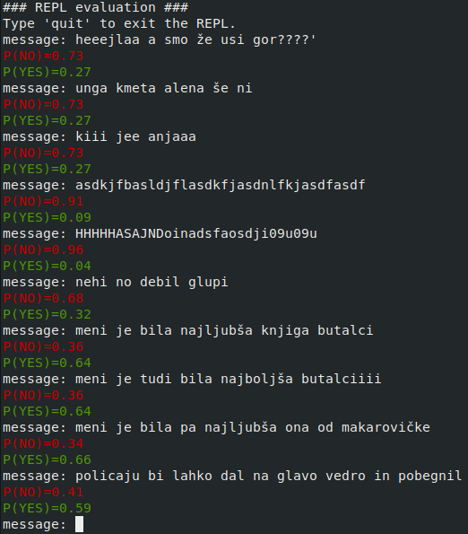

# Introduction

This repository contains the source code, results, and reports produced as part of a project aimed at analyzing on-line book discussions by elementary school-aged children. 
The discussions were obtained during studies performed to test the effectiveness of using the IMapBook software suite in 4th-grade classrooms.

We constructed a system for predicting whether messages posted during the discussion were relevant to the discussed books, whether the message is a statement, question or an answer, and also to which 
of the specified broad categories the message can be assigned.

# Using the Implemented Functionality

The implementation part of the repository is organized into three main directories. The *src* folder contains all the code developed for this project. The *data* folder contains the data in the
form of the original discussions, lists of given names, names found in stories, and curse words. The *results* folder contains all the results obtained during the evaluation. The file *results.txt*
contains various computed classification metrics obtained during the evaluations. The *.xlsx* files in the results folder contain messages either classified correctly or incorrectly. The *results/plots* 
subfolder contains all plots produced during evaluation.

## Obtaining the Data and Feature Representations

The messages and their relevant corresponding labels are parsed from the *data/discussions.xlsx* file. We also implemented parsing of a set of Slovene curse words and given names
from specified websites. The parsed curse words and names are stored in the curse\_words.txt and names.txt files respectively. The chat nicknames used in the discussions are also
parsed and stored in the *chat\_names.txt* file. The *story\_names.txt* file contains names and keywords found in stories being discussed. These can be entered manually or parsed from
the provided files. We also implemented a simple translation utility in the form of a dictionary mapping non-standard Slovene words to their standard counterparts. The mappings were obtained
from the JANES project data repository. The dictionary is contained in the *slo\_nstd\_dict.p* file and can be loaded using Python's pickle module. The file *clue\_words.txt* contains
some words deemed to be important for successful classification using domain knowledge.

To use this system, we must first parse the necessary data from the file containing the raw discussions as well as auxiliary data, such as the list of curse words and given names, from the web. 
This can be done by running the **parse.py** script in the *src* directory with the **--parse** command-line argument.

After running the **parse.py** script with the **--parse** command-line flag and inspecting the obtained curse words in the *curse\_words.txt* list as well as
the obtained given names in the *names.txt* files, run the script **parse.py** again but this time with the ***--initialize*** command-line flag. This will
build a dictionary aggregating all the data obtained in the previous step. The dictionary is saved using Python's pickle module in the *data/data-processed/* folder.

We are now ready to run the **feature\_engineering.py** script to perform feature engineering/extraction on the messages. Simply run the **feature\_engineering.py** script and
wait for the feature extraction process to end.

## Performing Model Evaluations

To perform model evaluations, run the **evaluate.py** script with the **--method CLF** option argument pair, where CLF specifies the classification model to use and can either be equal to **rf** for
the random forest model, **svm** for the Support vectorm machine model, **gboosting** for the gradient boosting model, **logreg** for the logistic regression model, or **stacking**
for the feature stacking method. The evaluation method to use can be specified with the **--eval-method METHOD** option argumnet pair, where METHOD can either be equal to **tts** or **cv** to
specify the use of a train-test split or 10 runs of 10-fold cross-validation respectively.

The prediction objective (category to predict) can be specified with the **--category CT** option argument pair, where CT can be equal to either **book-relevance** for the book relevance
prediction objective, **type** for the type prediction objective, **category** for the category prediction objective, or **category-broad** for the broad category prediction objective.

After the evaluation is successfully completed, the values of various classification metrics are written to the *results.txt* file in the results folder. If using the train-test split
method, the results folder will also contain various *.xlsx* files containing either correct or incorrect classifications.

## Performing Feature Scoring

To perform feature scoring, run the **evaluate.py** script with the **--action eval-features** option argument pair and also use either **--method gboosting** to use gradient boosting or
**--method logreg** to use logistic regresion. The results are found in the *feature_scores.txt* file in the *results* folder after the evaluation has finished.

## Confusion Matrices, ROC and AUROC

To plot the confusion matrix, use the **--action cm** option argument pair and specify the classification model and prediction objective in the same manner as when performing model
evaluation. To plot the ROC curve and compute the AUROC, use the **--action roc** option argument. The plotting of the ROC curve is only defined for the book relevance prediction objective
(binary classification problem).

## The REPL

The REPL functionality can be accessed by running the **evaluate.py** script with the ***--action repl*** command-line option argument pair. Additionally, the classification model can be.
specified using the ***--method*** option as described earlier. The REPL allows the evaluation of user-provided messages. It stores previous classification results to allow
the use of the Markov model and the conditional probabilities computed on training data. The REPL loop can be terminated by simply typing quit. The REPL processes each
message and outputs the probabilities resulting from running the classification algorithm. An example of a REPL session is shown below. The probabilities below messages indicate predicted
probabilities of messages being relevant to discussed books or not.

